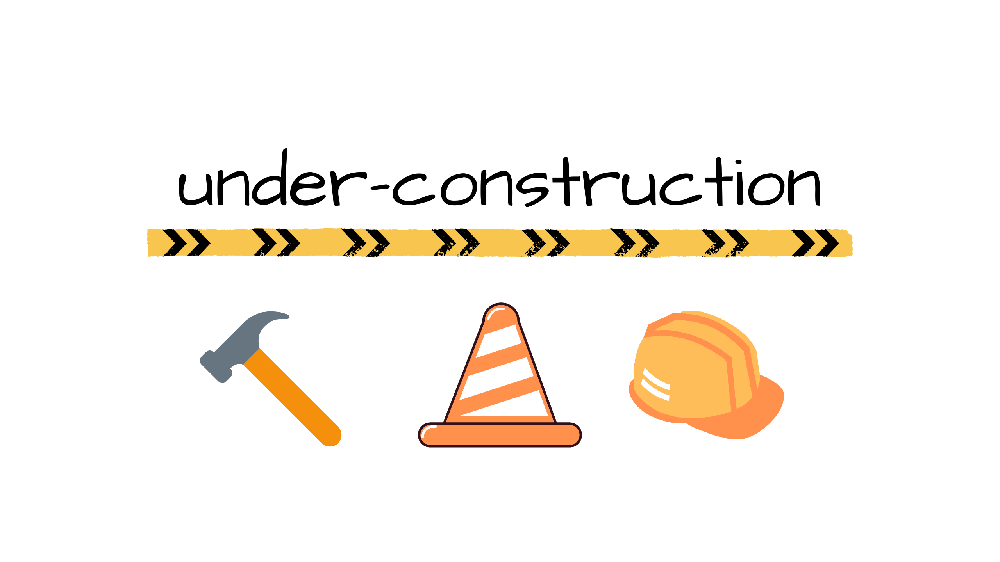

<h1 align="center"> Tool-Share </h1>
<h3 align="center"> ***Currently Under Construction*** </h3>
<h4 align="center"> Wireframing and Design </h4>

Welcome to the Tool-Share web application! This application gives homeowners and renters the ability to monetize unused assets.     

## Links

- [Live](https://kris-syevens.github.io/Tool-Share)

## Screenshots

## Available Commands

Not Applicable.

## Built With

- HTML
- CSS (Sass/Bootstrap)
- JavaScript
- Node.js / Express.js
- MongoDB
- React

## Future Updates

- [ ] None planned at this time.

## Author

**Kris Syevens**

- [Profile](https://github.com/Kris-Syevens "Kris Syevens")
- [Email](mailto:kris@syevens.com?subject=Hi "Hi!")
- [Website](http://syevens.com "Welcome")

## 🤝 Support

Contributions, issues, and feature requests are welcome!

Give a ⭐️ if you like this project!
